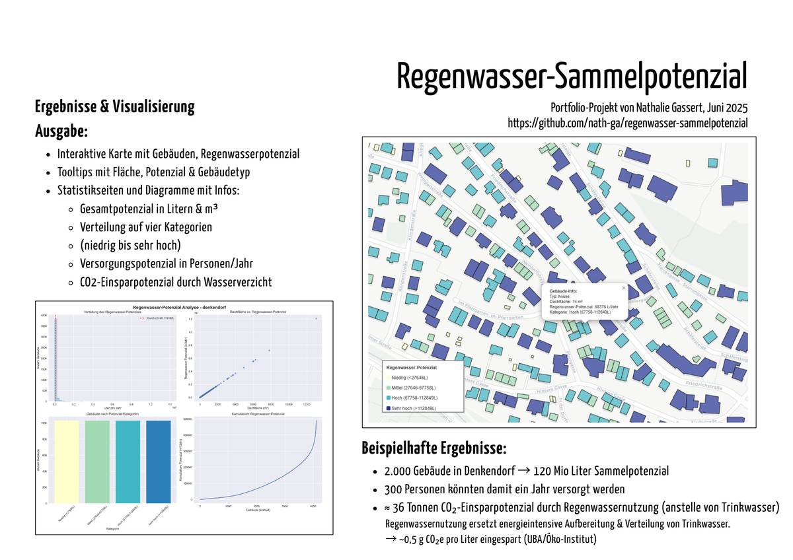

# README
# Regenwasser-Sammelpotenzial (Portfolio-Projekt)

Dieses Projekt ist Teil meines persönlichen Portfolios. Ziel ist es, das theoretische Regenwassersammelpotenzial aller Gebäudedächer in einem ausgewählten Gebiet zu ermitteln – basierend auf OpenStreetMap-Daten und aktuellen Wetterinformationen von Open-Meteo. Ziel ist es, visuell und statistisch darzustellen, wie viel Regenwasser jährlich theoretisch gesammelt werden könnte – sowohl für private Haushalte als auch für kommunale oder gewerbliche Gebäude. So sollen ungenutzte Potenziale sichtbar gemacht und das Bewusstsein für alternative Wassernutzung geschärft werden.

---

##  Struktur & Module

### `config.py`
Zentrale Konfigurationsdatei:
- `PLACE_NAME`: Vollständiger Ortsname für OSM-Anfragen
- `NAME_SHORT`: Kurzform für Dateibenennung
- `RAINFALL_MM_PER_YEAR`: Aktueller Jahresniederschlag (aus `03_get_precipitation.py`)

---

### `01_download_osm.py`
Lädt Gebäudedaten (Tag `building`) für den gewählten Ort über OSM.
- Speichert Gebäude als GeoJSON: `data/interim/<ort>_buildings.geojson`
- Berechnet Dachfläche in Quadratmetern (projiziert nach EPSG:32632)

---

### `02_calc_water_volume.py`
Berechnet das theoretische Regenwasserpotenzial je Dach:
- Multipliziert Dachfläche mit Jahresniederschlag
- Speichert Ergebnis mit Spalten: `area_m2`, `rain_liter_per_year`

---

### `03_get_precipitation.py`
Lädt den tatsächlichen Jahresniederschlag (2023) via Open-Meteo API.
- Standortkoordinaten aktuell fix auf Denkendorf gesetzt
- Ergebnis wird gespeichert in: `data/interim/precip_mm_2023.txt`

---

### `04_calc_water_volume.py`
Berechnet das theoretische Regenwasser-Sammelpotenzial für jedes Gebäude (Liter/Jahr).

---

### `05_visualize_results_stats.py`
Erweiterte Visualisierung und Analyse:
- Erstellt interaktive Karte mit farbcodierten Dächern (nach Potenzial)
- Zeigt Tooltips, Popups und Potenzialkategorien (Quartile)
- Berechnet Umweltimpact (z. B. CO₂-Einsparung)
- Generiert zusätzliche Statistiken und Diagramme (Histogramm, Scatterplot, Balkendiagramm, kumulatives Potenzial)

**Ausgabe:**
- Interaktive Karte: `outputs/figures/regenkarte_enhanced.html`
- Diagramme: `outputs/figures/regenwasser_statistiken.png`

---

##  Abhängigkeiten

- `osmnx==1.3.0`
- `geopandas`
- `pandas`
- `folium`
- `matplotlib`
- `seaborn`
- `requests`
- `numpy`

---

##  Projektstruktur

regenwasser-sammelpotenzial/
── 01_download_osm.py
── 02_calc_water_volume.py
── 03_get_precipitation.py
── 04_calc_water_volume.py
── 05_visualize_results_stats.py
── config.py
── data/
 └── interim/
 ├── <ort>_buildings.geojson
 └── precip_mm_YYYY.txt
── outputs/
 └── figures/
 ├── regenkarte_enhanced.html
 └── regenwasser_statistiken.png

##  Nächste Schritte (optional)

- [ ] Analyse größerer Gebiete mit Industrie-/Gewerbeflächen
- [ ] Berücksichtigung von Gründächern, PV-Anlagen etc.
- [ ] Export als PDF-Report oder Web-Dashboard
- [ ] Vergleich mehrerer Orte

---

##  Zielgruppe

- Bürger:innen & Hausbesitzer:innen
- Städte & Kommunen
- Umwelt- und Stadtplanungsprojekte
- Portfolio zur Demonstration von Geo- & Datenanalyse-Kompetenz

---

## Lizenz
Datenquellen: OpenStreetMap (ODbL), Open-Meteo (CC BY 4.0). Analysecode: Open Source.

## Projektvideo

Zur kompakten Vorstellung des Projekts:

> Dieses Video gibt einen Überblick über Motivation, Methodik und Ergebnisse.